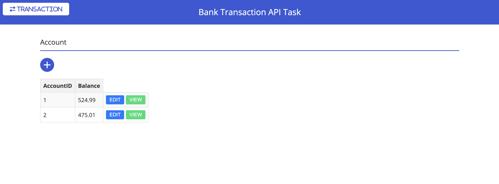
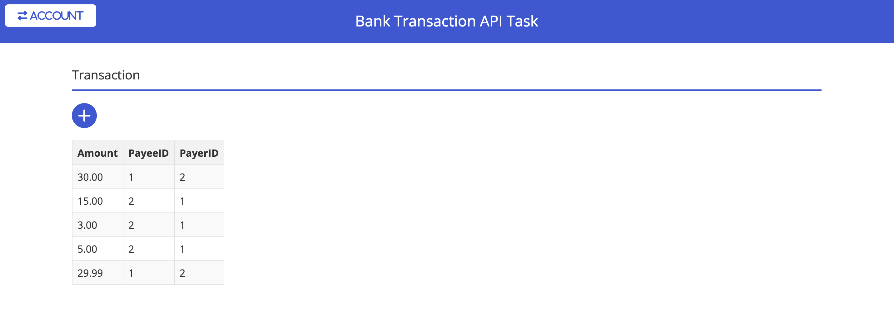

# Bank Transaction API Task
Controller Layer (HTML + Flask Routes)  
Service Layer (JavaScript/Flask Services)  
Repository Layer (Flask with Database)
## Preparation
### Database
- The database is based on MySQL.
- Check the status of MySQL by running:
  ```bash
  mysql --version
  ```
- Filled your database **username** and **password** into `backend/app.py`
   ```
   connection = mysql.connector.connect(
               host="localhost",
               user="jy",
               password="junlin902",
               database="bank_transactions"
            )
### Python
- Prepare all necessary library including
   ```
   import mysql.connector
   import logging
   import datetime
   from flask import Flask, jsonify, request
   from mysql.connector import Error
   from flask_cors import CORS
   from decimal import Decimal

## How to use
- Clone the project to local repo:
   ```
   git clone https://github.com/junlin0902/bank_transaction_api_task.git
- Set up the MySQL Database
   ```
   mysql -u"USERNAME" -p"PASSWORD" < sql/setup.sql
- Run flask service
   ```
   flask --app backend/app run
- Open `frontend/account.html` or `frontend/transaction.html` to begin
  


- Users can click `ACCOUNT` or `TRANSACTION` to switch between those two pages. There will be some default initial values.  
- Users can click the `ADD` button to create new account or transaction. 

- **Special case:  
If users try to create account, and that AccountID is exist, it will perform edit rather create.**

